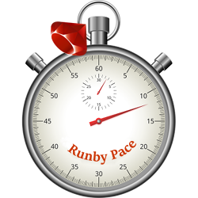

# Runby🏃Pace (Vue.js)

Vue.js implementation of [Runby🏃Pace](https://runbypace.com), which provides pace recommendations for different types of runs based on an individual runner's fitness level.

## Project setup

Here are the commands you'll use to work with the project. They're typical of most Vue.js projects.

| Command | Purpose |
| ------- | ------- |
| `npm install` | Setup packages |
| `npm run serve` | Compiles and hot-reloads for **development** |
| `npm run build` | Compiles and minifies for **production** |
| `npm run lint` | Lints and fixes files |
| `npm run test:unit` | Run unit tests |

## Contributing

Bug reports and pull requests are welcome. However, I'm very busy so YMMV.

Contribute your ideas at [@runbypace](https://twitter.com/runbypace).
